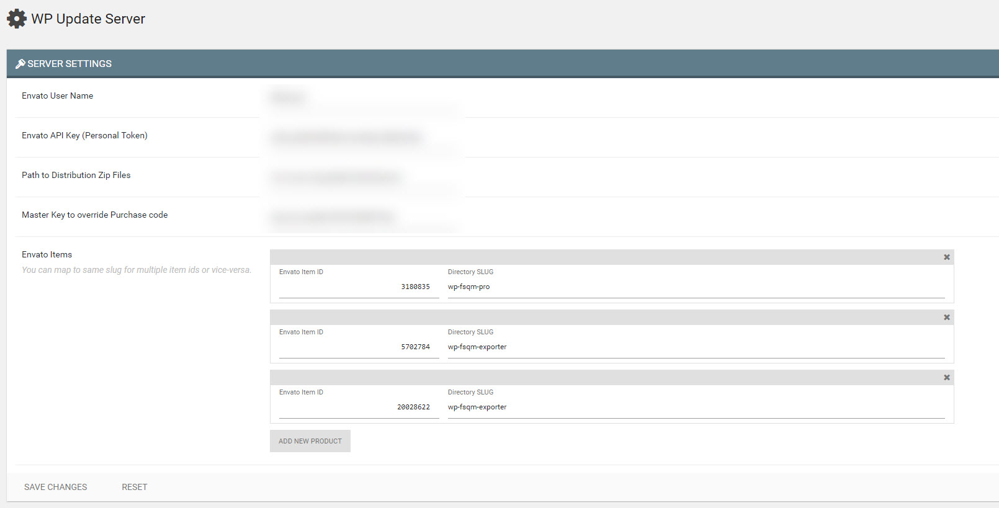

# WordPress Plugin/Theme Update Server for Envato

**Originally developed at [WPQuark Private GitLab](https://wpquark.io/wpq-server/wpq-wp-update)**

This plugins aims to convert your WordPress installation to a secure update server
for your plugins and themes hosted on envato market place.

## Usage

This plugin provides a server for easy updates with purchase code verification.
To set things up you need to install the server and configure your plugin.

### Installing the Server

* Install this plugin by a git clone.
* Install composer dependency `composer install`
* Make sure you have grunt available globally. `npm install grunt-cli -g`
* Build the plugin `npm install && grunt build`
* Activate Plugin.
* Go to WP Update > Settings
* Enter your Envato API Key and distribution directory
* Map Envato Item ID with ZIP Slug.

### Configuring your plugin/theme

* Modify and include the file under `client/class-plugin-autoupdate.php`.
* Point to your distribution server by editing the constants.
* Now you provide a UI for collecting purchase code from your user and when saving simply call like this:

```php
$updater = Plugin_AutoUpdate::instance();
$updater->set_token_from_code( wp_unslash( $_POST['purchase_code'] ) );
```

To show the activation status call this from anywhere

```php
$updater = Plugin_AutoUpdate::instance();
$activation_status = $updater->current_activation_status( $settings['purchase_code'] );
echo '<p>Activation Status: ' . ( true == $activation_status['activated'] ? 'Active' : 'Inactive' ) . '</p>';
echo '<p>Message: ' . $activation_status['msg'] . '</p>';
```

Hack away buddy, hack away.

### Releasing Updates

This follows the same logic as [wp-update-server](https://github.com/YahnisElsts/wp-update-server) with the added benifit to configure your distribution directory. These can be outside your public server and would still work.

Say you want to publish update for `wp-fsqm-pro.zip`. So place the file under `distributions/packages/wp-fsqm-pro.zip` and the server takes care of the rest.

You can even put banners in the `banners` directory. But you would need to point URL `/banner/` to the banner directory yourself ( through apache config or nginx config ).

I have a [GitLab CI workflow](https://about.gitlab.com/features/gitlab-ci-cd/) which puts the packages when-ever I tag a release. It looks something like this:

```yaml
# Our base image
image: wpquark/wptest-php-nodejs-grunt:latest

# mysql service
services:
- mysql

# Select what we should cache
cache:
  paths:
  - vendor/
  - node_modules/
  - bower_components/

# Our stages
stages:
  - test
  - build
  - deploy

# We test on php7
# default job to run on every commit, everywhere
test:
  stage: test
  tags:
    - wordpress
  before_script:
    # Install npm to get grunt and other stuff
    - npm install

    # Install all dependencies
    - grunt install

    # Create the build files (js/css) so that we can test them
    - grunt prep

    # Check the PHP Version
    - php -v

    # Install WordPress PHPUnit Test
    - bash bin/install-wp-tests.sh wordpress_test root mysql mysql $WP_VERSION
  script:
  - grunt test
  artifacts:
    paths:
      - build/
    expire_in: 1 week

# Now we build on merging to master
build:
  stage: build
  cache:
    paths:
      - vendor/
      - node_modules/
      - bower_components/
    policy: pull
  tags:
    - wordpress
  before_script:
    # Install npm to get grunt and other stuff
    - npm install
    # Install all dependencies
    - grunt install
  script:
    - grunt release
  artifacts:
    paths:
      - build/package
    expire_in: 1 week
  only:
    - master@wpq-develop/wp-fsqm-pro

# release job on tag
# It basically creates an installable zip file and attaches to the artifact
deploy-distribution:
  stage: deploy
  cache:
    paths:
      - vendor/
      - node_modules/
      - bower_components/
    policy: pull
  tags:
    - wordpress
  variables:
    CMD_CREATE_DIR: 'rm -rf '
  before_script:
    # Install npm to get grunt and other stuff
    - npm install
    # Install all dependencies
    - grunt install

    # Setup Environment variables to access keys & ssh agent
    - eval $(ssh-agent -s)
    - '[[ -f /.dockerenv ]] && echo -e "Host *\n\tStrictHostKeyChecking no\n\n" > ~/.ssh/config'

    # Make the build package if not found, because artifacts expire
    - '[[ ! -f build/package/wp-fsqm-pro.zip ]] && echo "Distribution Package not found. Making now..." && grunt release || echo "Found Distribution Package. Using from artifacts"'
  script:
    # Make sure we add the Staging Key so that we can SSH
    - ssh-add <(echo "$WPQ_DISTRIBUTION_KEY")
    # Delete old resources
    - ssh -p22800 wpqdist@gliese.itg-vps.com "rm -rf ~/distributions/packages/wp-fsqm-pro.zip && rm -rf ~/distributions/banners/wp-fsqm-pro-*"
    # Copy the distribution ZIP
    - scp -P22800 build/package/wp-fsqm-pro.zip wpqdist@gliese.itg-vps.com:~/distributions/packages
    # Copy Banners
    - scp -P22800 banners/wp-fsqm-pro-* wpqdist@gliese.itg-vps.com:~/distributions/banners
    # The server script should take care of it
  artifacts:
    name: 'wp-fsqm-pro'
    paths:
      - build/package/wp-fsqm-pro.zip
  environment:
    name: production/distribution
    url: https://dist.wpquark.io/wp-admin/
  dependencies:
    - build
  only:
    - /^release-.*$/@wpq-develop/wp-fsqm-pro
  except:
    - branches
```

Essentially I work on develop branch and once done, I merge to master. Then when I tag a release, the CI does everything else.

## ScreenShots



## Credits

* [wp-update-server](https://github.com/YahnisElsts/wp-update-server) - For providing the update server.
* [plugin-update-checker](https://github.com/YahnisElsts/plugin-update-checker) - For providing the client library.
* [WordPress Rest API](https://developer.wordpress.org/rest-api/extending-the-rest-api/) - For giving an access point for easy activation flow.

## License

**WordPress Update Server** is licensed under GPL-3.0.

    This program is free software: you can redistribute it and/or modify
    it under the terms of the GNU General Public License as published by
    the Free Software Foundation, either version 3 of the License, or
    (at your option) any later version.

    This program is distributed in the hope that it will be useful,
    but WITHOUT ANY WARRANTY; without even the implied warranty of
    MERCHANTABILITY or FITNESS FOR A PARTICULAR PURPOSE.  See the
    GNU General Public License for more details.

    You should have received a copy of the GNU General Public License
    along with this program.  If not, see <http://www.gnu.org/licenses/>.

## RoadMap

Right now the plugin is in alpha stage. This works, but requires you to build it.
Also the dashboard functionality isn't implemented.

* Complete the build process and host on WordPress.org
* Implement Dashboard with statistics.
* Write PHPUnit tests.

Originally developed at [WPQuark Private GitLab](https://wpquark.io/wpq-server/wpq-wp-update)
